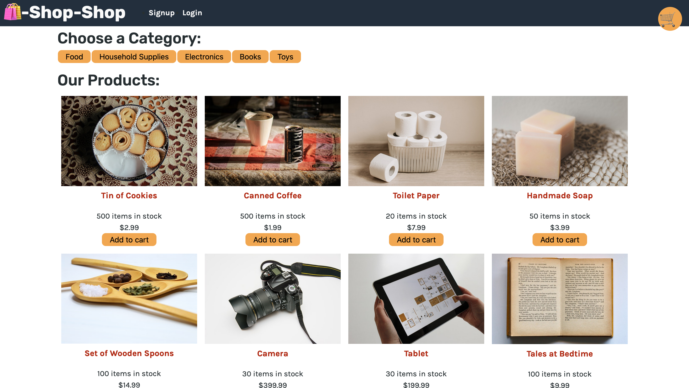

# Shop-Shop

Shop-Shop is an e-commerce platform that uses Redux to manage global state. The application uses a GraphQL API built with Apollo Server, a React front end, a MongoDB database, and a Node.js/Express.js server.

[https://agile-refuge-32946.herokuapp.com](https://agile-refuge-32946.herokuapp.com)